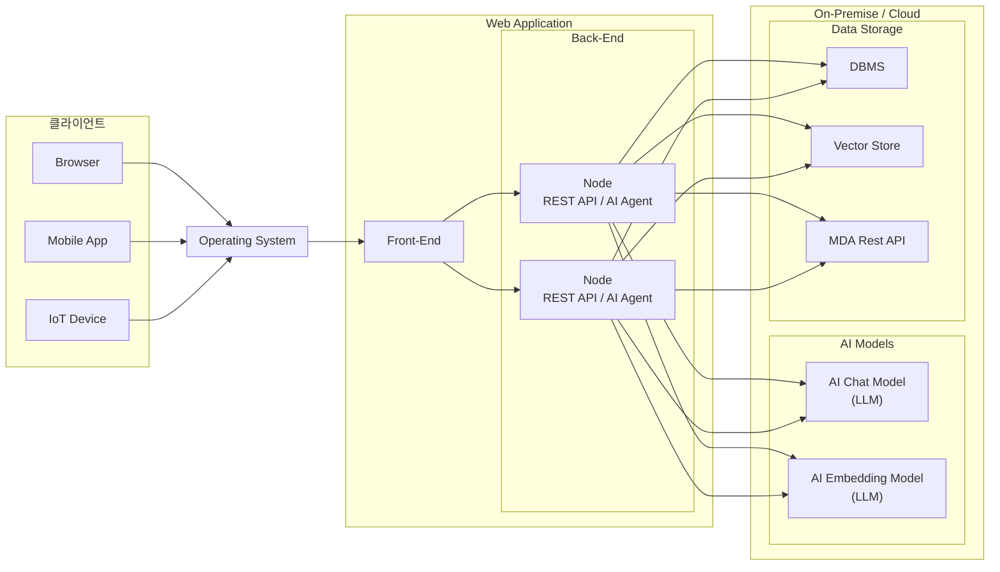

# Chapter 1. AI Application 아키텍처

> 핵심: open-api 키 발급하기, hello-world 찍어보기

## 1.1. AI 응용 서비스



AI Application은 크게 **클라이언트**, **웹 애플리케이션(Front-End / Back-End)**, **AI 모델 및 데이터 저장소** 세 영역으로 구성된다.

---

### 1.1.1 클라이언트 (Client)

사용자가 AI Application에 접근하는 진입점이다. 다양한 디바이스와 환경을 지원한다.

| 클라이언트 유형       | 설명                     |
|----------------|------------------------|
| **Browser**    | 웹 브라우저를 통한 접근          |
| **Mobile App** | iOS / Android 앱을 통한 접근 |
| **IoT Device** | 스마트 기기 등 임베디드 환경에서의 접근 |

모든 클라이언트는 운영체제(Operating System) 위에서 동작하며, Front-End로 요청을 전달한다.

---

## 1.1.2 웹 애플리케이션 (Web Application)

### 1.1.2.1 Front-End

클라이언트의 요청을 받아 사용자 인터페이스를 제공한다. Back-End와 통신하여 AI 기능을 사용자에게 전달한다.

### 1.1.2.2 Back-End

Front-End로부터 요청을 받아 처리하는 서버 영역이다. 수평 확장(Scale-out)이 가능한 다수의 노드로 구성된다.

각 노드는 다음 두 가지 역할을 수행한다.

- **REST API**: 클라이언트 요청을 처리하는 표준 HTTP 인터페이스
- **AI Agent**: AI 모델과 통신하여 추론, 검색, 생성 등의 AI 기능을 수행하는 에이전트

---

## 1.1.3 On-Premise / Cloud 영역

Back-End의 AI Agent가 호출하는 외부 AI 모델 및 데이터 저장소로 구성된다.

### 1.1.3.1. AI 모델 (LLM)

| 모델 유형                        | 역할                        |
|------------------------------|---------------------------|
| **AI Chat Model (LLM)**      | 사용자 질의에 대한 텍스트 생성 및 대화 처리 |
| **AI Embedding Model (LLM)** | 텍스트를 벡터로 변환하여 의미 기반 검색 지원 |

### 1.1.3.2. 데이터 저장소

| 저장소 유형           | 역할                                   |
|------------------|--------------------------------------|
| **DBMS**         | 구조화된 데이터(사용자 정보, 이력 등) 저장            |
| **Vector Store** | Embedding 모델이 생성한 벡터 데이터 저장 및 유사도 검색 |
| **MDA Rest API** | 외부 데이터 소스 연동을 위한 API 인터페이스           |

---

## 1.1.4. 개념 정리

- **AI Agent**: 단순 API 호출을 넘어, 상황에 따라 적절한 도구(Tool)를 선택하고 AI 모델과 상호작용하며 목표를 달성하는 자율적 컴포넌트
- **LLM (Large Language Model)**: 대규모 언어 모델. Chat과 Embedding 두 가지 유형이 주로 사용된다
- **RAG (Retrieval-Augmented Generation)**: Embedding 모델 + Vector Store 조합으로 관련 문서를 검색한 뒤, Chat 모델에 컨텍스트로 제공하여 더 정확한 응답을
  생성하는 기법
- **Vector Store**: 텍스트를 수치 벡터로 저장하고, 의미적으로 유사한 데이터를 빠르게 검색할 수 있는 데이터베이스

---

## 1.3. Spring AI 소개

AI 응용 서비스를 개발할 때 가장 먼저 마주치는 질문은 "어떻게 AI 모델에 입력 데이터를 전달하고, 모델의 결과물을 사용하여 어디에 전달하는가?"이다. 이 과정을 하나하나 직접 관리하려 하면 코드가 복잡해지고, 나중에 기능을 추가하거나 수정할 때 큰 어려움이 생긴다. 그래서 AI 애플리케이션을 위한 프레임워크가 필요하다.

### 1.3.1. LangChain vs Spring AI

파이썬 AI 애플리케이션 개발용 프레임워크인 **LangChain**은 프롬프트-응답 단계를 체인(chain) 형태로 연결해 데이터 흐름을 단순화하도록 설계되어 있다. 대화 기억, 문서 검색 기반 답변(RAG), 도구 호출 기능을 기본으로 제공한다.

자바 AI 애플리케이션 개발용으로 제공되는 **Spring AI**는 내부 구현 방식은 LangChain과 다르지만 유사한 기능을 제공한다. OpenAI, HuggingFace 등 다양한 LLM을 자동으로 구성하고, 엔터프라이즈 환경에 적합한 여러 벡터 저장소 연동을 지원한다. 대화 기억 저장 방식도 여러 옵션을 제공하며, RAG, 도구 호출, MCP 서버 개발 기능을 모두 제공한다.

| 비교 항목 | LangChain | Spring AI |
|-----------|-----------|-----------|
| 언어 / 플랫폼 | Python / Node.js | Java / Spring Boot |
| 핵심 개념 | 프롬프트-응답 단계를 체인(chain)으로 연결 | 스프링 빈으로 자동 주입된 API로 프롬프트-응답 단계를 메소드 호출로 처리 |
| 대화 기억 | 지원 | 지원 |
| 구조화된 출력(Structured Output) | JSON 형식 지원 | JSON 형식 및 자바 객체로 역직렬화 지원 |
| 벡터 저장소 | 지원 | 지원 |
| 도구(함수) 호출(Tool/Function Calling) | 지원 | 지원 |
| 멀티모달 지원 | 다양한 입력 데이터 지원 | 다양한 입력 데이터 지원 |
| 비동기 / 스트리밍 | asyncio 기반 | WebFlux 기반 |
| 문서 검색 기반 답변(RAG) | 지원 | 지원 |
| MCP Server 개발 | 미지원 | 지원 |

개발 언어, 방법, 런타임 플랫폼만 다를 뿐 제공하는 기능은 거의 동일하다.

### 1.3.2. Spring AI의 특징

Spring AI는 Spring 웹 애플리케이션에 익숙한 자바 개발자에게 친숙한 개발 경험을 제공한다.

- Spring Boot 환경 내에서 AI 모델을 일반 라이브러리처럼 손쉽게 다룰 수 있다.
- 자동 구성(Auto Configuration)을 통해 최소한의 코드로 개발 가능하다.
- 다양한 **Spring Boot Starter** 의존성을 지원한다.

> 공식 문서: https://docs.spring.io/spring-ai/reference/


```text
책 1.4 부터 1.7 까지는 환경 설정, open-ai api-key 설정, hello-world 성 프로젝트 띄우는 내용이라 생략
```

프로젝트 경로
- /src/this-is-ai/ch01-spring-ai-project
