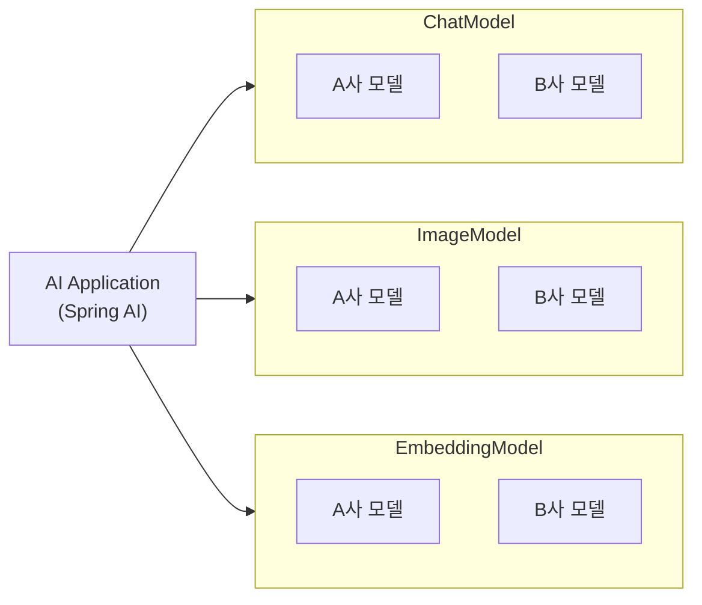
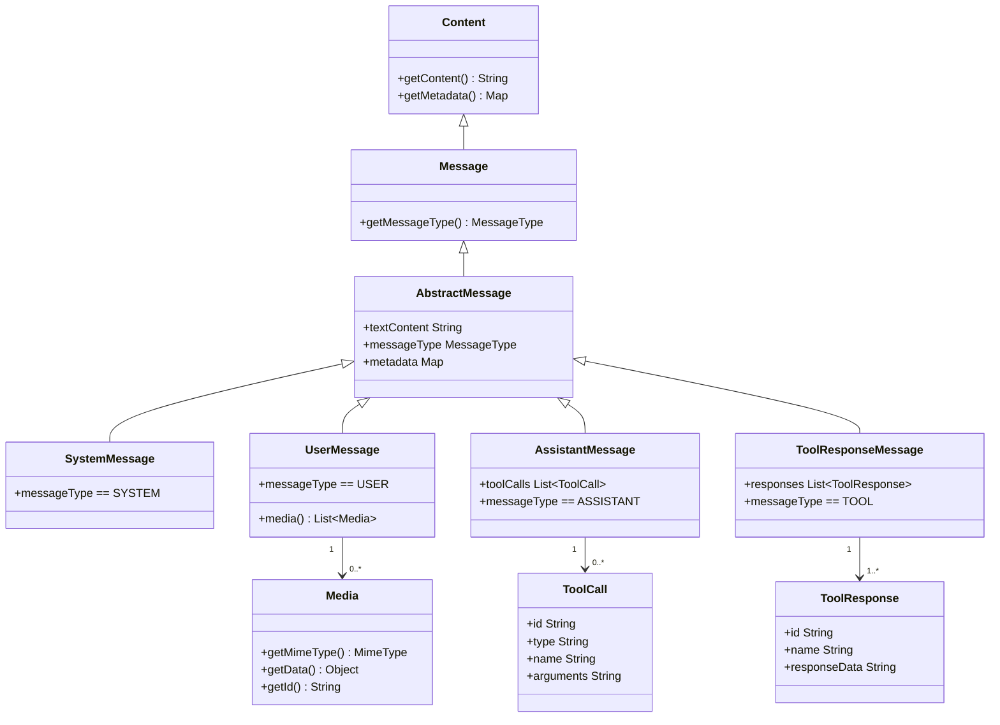
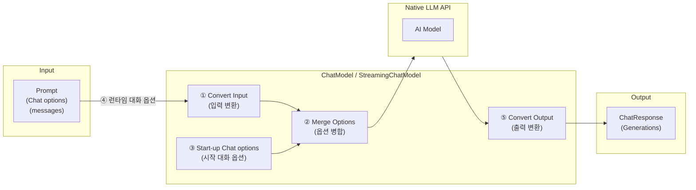

# Chapter 2. 텍스트 대화

## 2.1 Chat Model API

Spring AI는 다음과 같이 AI 모델을 분류하고 같은 분류에 속하는 모델들을 통일화된 방법으로 사용하기 위해 API를 제공하고 있습니다.

| 모델 구분           | 설명                             | 주요 API           |
|-----------------|--------------------------------|------------------|
| **Chat Model**  | Text, Image To Text 모델 (LLM)   | `ChatModel`      |
| Image Model     | Text To Image 모델               | `ImageModel`     |
| Audio Model     | Text To Speech, Speech To Text | `SpeechModel`    |
| Embedding Model | Text To Vector 모델              | `EmbeddingModel` |

개발자는 업체별 제공 API에 종속되지 않은 이들 API를 이용해서 모델을 호출하고, 응답을 처리할 수 있습니다. 그래서 AI 모델이 변경되더라도 애플리케이션의 소스 변경을 최소화할 수 있습니다.



다른 API는 다른 장에서 설명하기로 하고, 이번 장은 Chat Model API에 대해서만 학습하겠습니다. 이 API는 사전 학습된 LLM을 활용하여 사용자의 텍스트 질문 및 이미지를 분석하고 인간처럼 텍스트
답변을 생성합니다.

Chat Model API는 역할별로 시스템 메시지와 사용자 메시지를 생성하고, 이것을 LLM에 전송합니다. LLM은 학습 데이터와 전달받은 배열에 따라 적절한 이해를 바탕으로 생성하고 AI 메시지를 반환합니다.

### ChatModel 인터페이스

Chat Model API는 다양한 AI 모델과 상호작용할 수 있는 간편한 인터페이스로 설계되어 있기 때문에, 개발자들이 최소한의 코드 변경으로 다른 LLM으로 쉽게 전환할 수 있습니다.

`ChatModel`은 `Model`을 상속받는 텍스트 기반 대화형 인터페이스입니다. `ChatModel` 인터페이스 정의는 다음과 같습니다.

```java
public interface ChatModel
        extends Model<Prompt, ChatResponse> {
    default String call(String message) {
        // ...
    }

    @Override
    ChatResponse call(Prompt prompt);
}
```

- `call()` 메서드는 매개값으로 주어진 문자열, 메시지, 프롬프트를 가지고 LLM에게 동기 요청을 보냅니다. 그리고 LLM으로부터 완전한 응답을 받고 `String` 또는 `ChatResponse`로 반환합니다.
- `StreamingChatModel`에서 상속받은 `stream()` 메서드는 매개값으로 주어진 문자열, 메시지, 프롬프트를 가지고 LLM에게 비동기 요청을 보냅니다. 자세한 설명은 바로 이어서 나오는 `StreamingChatModel` 인터페이스에서 하겠습니다.

### StreamingChatModel 인터페이스

`StreamingChatModel`은 비동기 스트림 텍스트 응답을 위해 `StreamingModel`을 상속받는 텍스트 기반 대화형 인터페이스입니다. `StreamingChatModel` 인터페이스 정의는 다음과 같습니다.

```java
public interface StreamingChatModel
        extends StreamingModel<Prompt, ChatResponse> {
    default Flux<String> stream(String message) {
        // ...
    }

    @Override
    Flux<String> stream(Prompt prompt);
}
```

`stream()` 메서드는 매개값으로 주어진 문자열, 메시지, 프롬프트를 가지고 LLM에게 비동기 요청을 보냅니다. 그리고 LLM으로부터 스트리밍 응답을 받으면 `Flux<ChatResponse>`로 반환합니다.

`Flux<T>`는 Spring Reactive Web에서 제공하는 타입입니다. 비동기이고 이벤트 기반으로 여러 개의 T 항목을 순차적으로 낼 수 있는 스트림을 나타냅니다. 전통적인 Java 컬렉션(`List`, `Stream` 등)이 모든 T 항목을 한꺼번에 가져와 메모리에 올려놓고 순차 처리 후 반환하는 것과 달리, `Flux`는 모든 T 항목을 한꺼번에 가져오지 않고, 하나씩 청크 단위로 가져오기 때문에 메모리 사용량을 줄입니다.

`Flux<T>`는 비동기 스케줄러로 이벤트 루프(event loop)나 비동기 스케줄러를 활용해 T 항목을 처리하므로, I/O 작업(웹 요청, 데이터베이스 조회, 파일 입출력)이 끝날 때까지 스레드를 블로킹하지 않습니다. 따라서 고성능, 대규모 동시성 처리가 가능하며, 자원을 효율적으로 사용할 수 있습니다. 컨트롤러 메서드가 `Flux<T>`를 반환하면, 응답 본문의 타입은 `MediaType.APPLICATION_NDJSON_VALUE`(`application/x-ndjson`)가 되며 T 각각은 한 줄의 JSON으로 직렬화해서 라인 단위로 순차적으로 출력됩니다. 이처럼 `Flux<T>`는 실시간 채팅, 로그 스트리밍, 서버 이벤트 전송 등 다양한 시나리오에서 핵심 역할을 합니다.

### Prompt 클래스

`Prompt` 클래스는 `ModelRequest` 인터페이스의 구현체로 복수 개의 시스템 메시지(`SystemMessage`), 사용자 메시지(`UserMessage`), 그리고 AI 메시지(`AssistantMessage`)를 저장합니다. 그리고 LLM 요청 시 전달할 수 있는 공통 옵션들을 정의하고 있습니다.

```java
public class Prompt implements ModelRequest<List<Message>> {
    private final List<Message> messages;
    private ChatOptions modelOptions;
}
```

### Message 인터페이스

애플리케이션에서 사용하는 메시지의 종류는 `SystemMessage`, `UserMessage`, `AssistantMessage`, `ToolResponseMessage`가 있습니다. 이들 `Message`는 역할에 따라 사용되며 기본적으로 `Message` 인터페이스를 구현합니다. 멀티모달을 지원하기 위해 `UserMessage`와 `AssistantMessage`는 `MediaContent` 인터페이스를 추가적으로 구현하고 있습니다.



**메시지 타입별 역할:**

| 메시지 타입           | 역할 설명                                                                          |
|--------------------|---------------------------------------------------------------------------------|
| `SystemMessage`      | LLM의 행동과 응답 스타일을 지시하는 메시지입니다. 주로 LLM이 어떻게 행동하고 반응할지를 정의합니다.    |
| `UserMessage`        | 사용자가 질문, 명령을 담고 있는 메시지입니다. LLM에게 요청을 생성하는 기초가 되는 메시지입니다.        |
| `AssistantMessage`   | LLM의 응답 메시지입니다. 단순히 직전의 결과물뿐만 아니라 처음부터 현재까지의 전체 대화 히스토리를 포함합니다. |
| `ToolResponseMessage`| 도구 호출 결과를 LLM으로 다시 반환할 때 사용하는 내부 메시지입니다.                              |

이들 `Message`는 공통적으로 다음과 같은 데이터를 포함하고 있습니다.

- 텍스트 내용(text)
- Map 타입의 메타데이터(metadata)
- 메시지 타입(messageType): `SYSTEM`, `USER`, `ASSISTANT`, `TOOL`

`UserMessage`와 `AssistantMessage`는 멀티모달을 지원하기 위해 `List<Media>`를 추가적으로 포함하고 있습니다.

### ChatOptions 인터페이스

`Prompt`가 가지고 있는 대화 옵션(`ChatOptions`)에는 LLM 종류와 상관없이 LLM과 대화할 때 사용할 수 있는 공통 옵션들을 정의하고 있습니다.

```java
public interface ChatOptions extends ModelOptions {
    String getModel();            // 대화에 사용할 모델 이름
    Integer getMaxTokens();       // 생성할 응답의 최대 토큰 수
    Float getTemperature();       // 출력 다양성 조절 값(0.0~1.0), 값이 클수록 더 다양한 응답 생성
    Integer getTopK();            // 상위 K개 토큰 중에서 선택하는 방식, 값이 클수록 더 다양한 응답 선택
    Float getTopP();              // 누적 확률 P 이하인 단어 중에서 선택(0.0~1.0), 값이 클수록 더 다양한 응답 생성
    Float getPresencePenalty();   // 반복된 내용에 대한 패널티 값(-2.0~2.0), 값이 클수록 반복 내용 줄이기
    Float getFrequencyPenalty();  // 동일한 단어가 자주 반복될 패널티 값(-2.0~2.0), 값이 클수록 반복 줄이기
    List<String> getStopSequences(); // 응답 생성 중단 기준이 되는 문자열 목록
}
```

업체별 LLM 모델에 전달할 수 있는 고유한 옵션이 더 있습니다. 예를 들어, OpenAI Chat Completion 모델은 `logitBias`, `seed`, `user`와 같은 옵션을 가지고 있습니다. 이러한 옵션은 각 업체별 구현체에서 확인할 수 있으며, 지금은 공통 옵션 중심으로 학습하기 바랍니다.

### ChatResponse 클래스

`ChatResponse`는 LLM의 출력 내용을 가지고 있습니다. LLM이 프롬프트를 처리하면서 생성한 여러 출력을 각각 `Generation`으로 생성하고 있습니다. 그리고 LLM 응답과 관련된 메타데이터를 `ChatResponseMetadata`로 저장하고 있습니다.

```java
public class ChatResponse implements ModelResponse<Generation> {
    private final ChatResponseMetadata chatResponseMetadata;
    private final List<Generation> generations;
}
```

### Generation 클래스

`Generation`은 LLM 출력 내용을 `AssistantMessage` 형태로 저장합니다. 그리고 관련된 메타데이터를 `ChatGenerationMetadata`로 저장합니다.

```java
public class Generation implements ModelResult<AssistantMessage> {
    private final AssistantMessage assistantMessage;
    private ChatGenerationMetadata chatGenerationMetadata;
}
```

### LLM 제공 업체별 구현 클래스

LLM 제공 업체별로 Chat Model API 인터페이스를 구현한 클래스는 다음 페이지에서 확인할 수 있습니다.

- https://docs.spring.io/spring-ai/reference/api/chatmodel.html#_available_implementations

그리고 이들 구현체에 대한 비교는 다음 페이지에서 확인할 수 있습니다.

- https://docs.spring.io/spring-ai/reference/api/chat/comparison.html

## 2.2 Chat Model API 사용하기

다음 그림은 Chat Model API의 사용 흐름을 보여줍니다. ①~⑤까지 대화 옵션(`ChatOptions`)이 언제 초기화되고, 병합되는지 대화 옵션과 관련된 흐름입니다.



1. **시작 대화 옵션**: Spring AI가 처음에 업체별 스타터 의존성을 추가하면 자동 구성 과정을 통해 `application.properties` 값을 초기화합니다. 이 초기값을 스타트업 대화 옵션이라고 합니다.
2. **런타임 대화 옵션**: 각 LLM 요청 시 전송하는 `Prompt`에는 추가로 런타임 대화 옵션(`ChatOptions`)을 포함시킬 수 있습니다.
3. **대화 옵션 병합**: 시작 대화 옵션과 런타임 대화 옵션을 결합합니다. 항상 런타임 대화 옵션의 우선순위가 높기 때문에 시작 대화 옵션을 변경하지 않아도 됩니다.
4. **입력 변환**: `Prompt`의 메시지들과 병합된 대화 옵션을 LLM 모델이 이해할 수 있는 네이티브 형식으로 변환합니다.
5. **출력 변환**: LLM의 출력을 표준화된 `ChatResponse` 형식으로 변환합니다.

---

Chat Model API를 이용해서 OpenAI에서 제공하는 LLM과 사용자가 대화하는 애플리케이션을 개발하는 방법에 대해 설명하겠습니다.

**01** VS Code로 `book-spring-ai/projects/ch02-chat-model-api` 프로젝트 폴더를 엽니다.

**02** `service/AiService.java` 파일을 엽니다. 이 서비스 클래스는 Chat Model API를 이용해서 LLM에게 요청하고 응답을 받는 메서드들이 선언되어 있습니다.

**03** 먼저 `generateText()` 메서드 내용을 보겠습니다.

```java
@Service
@Slf4j
public class AiService {

    @Autowired
    private ChatModel chatModel;                                    // ①

    public String generateText(String question) {

        // ② 시스템 메시지 생성
        SystemMessage systemMessage = SystemMessage.builder()
                .text("사용자 질문에 대해 한국어로 답변을 합니다.")
                .build();

        // ③ 사용자 메시지 생성
        UserMessage userMessage = UserMessage.builder()
                .text(question)
                .build();

        // ④ 대화 옵션 생성
        ChatOptions chatOptions = ChatOptions.builder()
                .model("gpt-4o-mini")
                .temperature(0.3)
                .maxTokens(1000)
                .build();

        // ⑤ 프롬프트 생성
        Prompt prompt = Prompt.builder()
                .messages(systemMessage, userMessage)
                .chatOptions(chatOptions)
                .build();

        // ⑥ LLM에게 요청하고 응답받기
        ChatResponse chatResponse = chatModel.call(prompt);
        AssistantMessage assistantMessage = chatResponse.getResult().getOutput();
        String answer = assistantMessage.getText();

        return answer;
    }
}
```

1. `ChatModel` 빈을 주입받습니다. `spring-ai-starter-model-openai` 스타터를 이용해서 ChatModel 구현체인 OpenAI LLM 클래스가 자동 등록됩니다.
2. LLM에게 지시할 내용을 `SystemMessage`로 생성합니다. 사용자 질문에 대해 한국어로 답변하라고 지시하고 있습니다.
3. 매개값으로 받은 텍스트로 `UserMessage`를 생성합니다. 사용자 질문을 담고 있습니다.
4. 런타임 대화 옵션(`ChatOptions`)을 설정합니다. `temperature`를 0.3으로 낮추어 다양한 응답 생성을 줄이고, 최대 토큰 수를 1000으로 고정했습니다.
5. LLM에 전송할 `Prompt`를 생성합니다. `SystemMessage`와 `UserMessage`를 담고 `ChatOptions`도 같이 포함시킵니다.
6. `ChatModel`의 `call()` 메서드를 동기 방식으로 요청합니다. 응답이 올 때까지 블로킹하고, `ChatResponse`를 반환받아 응답 텍스트를 추출합니다.

> **온도(temperature)**
>
> LLM의 응답 창의성(다양성)을 조정하는 하이퍼파라미터입니다. 낮은 값으로 일관성 있고 예측 가능한 답변을 생성하고, 높은 값은 더 창의적이고 예상치 못한 답변을 생성합니다. 값 범위는 0.0 ~ 1.0입니다.

**애플리케이션 구성 파일에서 기본 모델 변경**

Spring AI 1.1의 OpenAI 스타터가 사용하는 기본 LLM인 `gpt-4o-mini` 대신 다른 LLM을 사용하고 싶다면, 애플리케이션 구성 파일(`application.properties`)에서 변경할 수 있습니다.

```properties
## OpenAI
spring.ai.openai.api-key=${OPENAI_API_KEY}
spring.ai.openai.chat.options.model=gpt-4o
```

> **토큰(token)**
>
> LLM이 언어를 처리할 때 문장을 잘게 나누는 단위입니다. 일반적으로 단어, 단어의 일부 또는 단일 문자 단위로 나눌 수 있습니다. 클라우드에서 서비스하는 LLM은 입력과 출력 전체의 토큰 수에 따라 비용을 계산합니다.
>
> LLM에는 한 번의 요청에서 처리할 수 있는 최대 토큰 수 제한이 있습니다. 이를 **컨텍스트 윈도우(context window)**라고 하며, 이 개수를 넘어서면 나머지 내용은 처리하지 못합니다. 예를 들어 `gpt-4o-mini`는 최대 128,000 토큰의 컨텍스트 윈도우와 16,384 토큰의 최대 출력을 지원합니다.
>
> LLM별 컨텍스트 윈도우는 각 모델 페이지에서 확인할 수 있습니다. (예: https://platform.openai.com/docs/models/gpt-4o-mini)

**04** `controller/AiController.java` 파일을 엽니다. 이 컨트롤러 클래스에는 `/ai/chat-model` 요청 매핑 메서드가 선언되어 있습니다.

```java
@RestController
@RequestMapping("/ai")
@Slf4j
public class AiController {

    @Autowired
    private AiService aiService;                                    // ①

    @PostMapping(
        value = "/chat-model",
        consumes = MediaType.APPLICATION_FORM_URLENCODED_VALUE,
        produces = MediaType.TEXT_PLAIN_VALUE                       // ②
    )
    public String chatModel(@RequestParam("question") String question) {
        String answerText = aiService.generateText(question);       // ③
        return answerText;
    }
}
```

1. `AiService`를 빈으로 주입합니다.
2. 클라이언트에 반환하는 응답 타입(`produces`)을 `text/plain`으로 지정합니다.
3. 요청 파라미터에서 `question` 값을 받고, `AiService`의 `generateText()` 메서드를 호출합니다.

**05** 프로젝트를 실행합니다. 브라우저에서 `http://localhost:8080`으로 요청하면 버튼 2개가 있는 페이지가 나옵니다. 첫 번째 버튼인 [chat-model] 버튼을 클릭합니다.

**06** 질문 입력란에 질문을 입력하고 [제출] 버튼을 클릭합니다. 사용자 질문을 입력하면 대화가 이뤄지고, 대화 패널에 답변이 출력됩니다. 응답이 오기까지 스피너가 나타났다가 답변이 도착하면 사라집니다.

## 2.3 ChatModel 스트리밍 응답

이전 실습에서 대화 한 번에 AI 답변 텍스트가 한 번에 출력되는 것을 보았습니다. 이것은 동기 방식이라고 합니다. ChatGPT처럼 답변이 자연스럽게 출력되도록 하려면 Back-End에서 LLM의 요청 방법을 달리해야 합니다.

**01** `service/AiService.java` 파일을 엽니다. 이전 `generateText()` 메서드에서는 `ChatModel`의 `call()` 메서드를 사용했습니다. 이번에는 `generateStreamText()` 메서드를 살펴보겠습니다. 이 메서드는 LLM으로 요청할 때 `stream()` 메서드를 사용합니다.

**02** `generateStreamText()` 메서드를 살펴보겠습니다.

```java
public Flux<String> generateStreamText(String question) {

    // ... (SystemMessage, UserMessage, ChatOptions, Prompt 생성은 generateText()와 동일)

    // ① LLM에게 요청하고 응답받기
    Flux<ChatResponse> fluxResponse = chatModel.stream(prompt);

    // ② Flux<ChatResponse>를 Flux<String>으로 변환
    Flux<String> fluxString = fluxResponse.map(chatResponse -> {   // ③
        AssistantMessage assistantMessage = chatResponse.getResult().getOutput();
        String chunk = assistantMessage.getText();
        if (chunk == null) chunk = "";
        return chunk;
    });

    return fluxString;
}
```

1. 반환 타입이 `Flux<String>`으로 바뀌었습니다. LLM의 완전한 문장을 한 번에 출력하는 것이 아니라, 응답이 생성될 때마다 하나의 텍스트 청크를 순차적으로 출력합니다.
2. `ChatModel`의 `stream()` 메서드를 호출합니다. `Flux<ChatResponse>` 타입으로 반환합니다.
3. `map()` 메서드를 이용해서 `Flux<ChatResponse>`를 `Flux<String>`으로 변환합니다. 각 `ChatResponse`로부터 `AssistantMessage`를 얻고, 텍스트 청크를 추출합니다.

**03** `controller/AiController.java` 파일을 엽니다. `/ai/chat-model-stream` 요청을 받는 매핑 메서드를 보겠습니다.

```java
@RestController
@RequestMapping("/ai")
@Slf4j
public class AiController {

    @PostMapping(
        value = "/chat-model-stream",
        consumes = MediaType.APPLICATION_FORM_URLENCODED_VALUE,
        produces = MediaType.APPLICATION_NDJSON_VALUE              // ① 라인으로 구분된 청크 텍스트
    )
    public Flux<String> chatModelStream(@RequestParam("question") String question) {
        Flux<String> answerStreamText = aiService.generateStreamText(question); // ②
        return answerStreamText;
    }
}
```

1. 응답 본문의 타입을 `application/x-ndjson`으로 설정합니다. 청크 텍스트를 라인 단위로 구분된 JSON으로 변환합니다.
2. 사용자의 질문을 매개값으로 `AiService`의 `generateStreamText()` 메서드를 호출합니다. `Flux<String>`을 바로 반환합니다.

**04** 브라우저에서 스트리밍 텍스트를 출력하는 자바스크립트 코드를 살펴보겠습니다. `/src/main/resources/templates/chat-model-stream.html`의 AJAX 요청 코드입니다.

```javascript
// AJAX 요청하고 응답받기
const response = await fetch('/ai/chat-model-stream', {
    method: 'post',
    headers: {
        'Content-Type': 'application/x-www-form-urlencoded',
        'Accept': 'application/x-ndjson'  // ① 라인으로 구분된 청크 텍스트
    },
    body: new URLSearchParams({ question })
});

// AI 모델 답변 영역 필드에 추가
const uuid = springai.addAnswerPlaceholder('chatPanel');  // ②

// 텍스트 단어 출력하기
springai.printAnswerText(response.body, uid, 'chatPanel');
```

1. 받고 싶은 응답 본문 타입은 `application/x-ndjson`을 요청합니다.
2. AI 모델 답변 영역을 대화 패널에 추가합니다.

**05** `/src/main/resources/static/js/springai.js` 파일에 있는 `printAnswerStreamText()` 함수를 보겠습니다.

```javascript
springai.printAnswerText = async function(responseBody, targetId, chatPanelId) {
    // printAnswerStreamText()에 위임
};

springai.printAnswerStreamText = async function(responseBody, targetId, chatPanelId) {
    const targetElement = document.getElementById(targetId);       // ①
    const reader = responseBody.getReader();                       // ②
    const decoder = new TextDecoder('utf-8');                     // ③
    let content = '';
    while (true) {                                                 // ④
        const { value, done } = await reader.read();
        if (done) break;
        let chunk = decoder.decode(value);
        if (springai.isOpenTagIncomplete(chunk)) {
            content += chunk;
        } else {
            content = '';
        }
        targetElement.innerHTML = content;
        springai.scrollToHeight(chatPanelId);
    }
};
```

1. `targetId`로 답변을 표시할 DOM 요소를 가져옵니다.
2. 응답 본문을 읽기 위한 `Reader`를 가져옵니다.
3. 응답 본문을 UTF-8로 디코딩하는 `decoder`를 생성합니다.
4. `while(true)` 루프로 청크 텍스트가 올 때마다 읽습니다. `done`이 `true`가 되면 모든 청크를 다 읽은 것이므로 루프를 종료합니다. HTML 태그가 완전히 닫힌 경우에만 `innerHTML`에 할당하며, 태그가 완전하지 않으면 다음 청크까지 `content`에 누적합니다.

**06** 프로젝트를 실행합니다. 브라우저에서 `http://localhost:8080`으로 요청하면 두 번째 버튼인 [chat-model-stream] 버튼을 클릭합니다.

**07** 질문 입력란에 질문을 입력하고 [제출] 버튼을 클릭합니다. 답변이 한 번에 출력되는 것이 아니라, 단어 단위로 자연스럽게 보여집니다.

## 2.4 ChatClient 사용하기

지금까지 Chat Model API를 직접 사용하여 LLM과 대화해봤습니다. `ChatModel`은 모델의 옵션이나, 모델의 응답을 세밀하게 관리하고 싶을 때 사용하면 좋지만, 단일 질문—단답 처리를 넘어 복잡한 흐름을 처리하기가 번거롭습니다.

대화 기억을 유지하거나, 벡터 저장소의 유사도 검색 결과를 추가하거나, 도구 호출을 위한 메시지 교환 등과 같은 복잡한 데이터 흐름을 관리하는 기능이 `ChatModel`에는 없습니다. Spring AI는 이러한 복잡한 데이터 흐름을 관리하는 고급 수준의 `ChatClient`를 별도로 제공하고 있습니다.

`ChatClient`는 어드바이저(`Advisor`)들을 체인으로 묶을 수 있습니다. 어드바이저들은 순차적으로 실행하면서 프롬프트에 필요한 내용을 추가합니다. 예를 들어 이전 대화 내용을 추가하거나, RAG 시스템에서 벡터 저장소의 검색 결과를 프롬프트에 추가하는 작업을 할 수 있습니다.

또한 사용자의 질문에 LLM에서 처리가 힘든 경우, 도구(`Tool Calling`) 호출을 할 수 있습니다. 도구는 애플리케이션 측에서 실행하고, 호출 결과는 LLM이 이용하기 때문에 애플리케이션과 LLM 간의 복잡한 대화 흐름이 발생합니다. 이러한 흐름을 `ChatClient`는 관리합니다.

따라서 이 책에서는 특별한 이유가 없는 한 LLM을 이용할 때 `ChatClient`를 사용합니다. `ChatClient`를 얻는 방법은 두 가지가 있습니다.

첫 번째는 `ChatClient.Builder` 빈을 주입받아서 `ChatClient`를 얻는 방법입니다.

```java
private ChatClient chatClient;

public XxxService(ChatClient.Builder chatClientBuilder) {
    this.chatClient = chatClientBuilder.build();
}
```

두 번째는 `ChatModel` 빈을 매개값으로 해서 `ChatClient.builder().build()` 메서드로 얻는 방법입니다.

```java
private ChatClient chatClient;

public XxxService(ChatModel chatModel) {
    this.chatClient = ChatClient.builder(chatModel).build();
}
```

**01** `service/AiServiceByChatClient.java` 파일을 엽니다. `AiService`에서 `ChatModel` 대신 `ChatClient`를 사용하도록 수정한 클래스입니다. 필드와 생성자부터 보겠습니다.

```java
@Service
@Slf4j
public class AiServiceByChatClient {

    // #### 생성자 ####
    private ChatClient chatClient;

    public AiServiceByChatClient(ChatClient.Builder chatClientBuilder) {
        this.chatClient = chatClientBuilder.build();
    }
}
```

- 필드에는 `ChatModel` 대신 `ChatClient`로 대체되었습니다.
- 자동 구성된 `ChatClient.Builder` 빈을 매개값으로 주입받고, `build()` 메서드를 호출해서 `ChatClient` 인스턴스를 얻습니다.

**02** 수정된 `generateText()` 메서드를 보겠습니다.

```java
public String generateText(String question) {
    String answer = chatClient.prompt()
            .system("사용자 질문에 대해 한국어로 답변을 해야 합니다.")
            .user(question)
            .options(ChatOptions.builder()
                    .temperature(0.3)
                    .maxTokens(1000)
                    .build())
            .call()
            .content();
    return answer;
}
```

- `SystemMessage`는 `system()`으로, `UserMessage`는 `user()`로 간결하게 작성할 수 있습니다. `ChatOptions`는 `options()` 메서드로 설정하고, `call()` 이후 `content()` 메서드를 호출해서 바로 답변 텍스트를 반환합니다.

**03** 수정된 `generateStreamText()` 메서드를 보겠습니다.

```java
public Flux<String> generateStreamText(String question) {
    Flux<String> fluxString = chatClient.prompt()
            .system("사용자 질문에 대해 한국어로 답변을 해야 합니다.")
            .user(question)
            .options(ChatOptions.builder()
                    .temperature(0.3)
                    .maxTokens(1000)
                    .build())
            .stream()
            .content();
    return fluxString;
}
```

- `call()` 대신 `stream()` 메서드를 호출하면 됩니다. `ChatResponse`, `AssistantMessage`를 직접 다루지 않아도 되므로 코드가 매우 간결해집니다. `Flux<String>`을 `content()` 메서드 하나로 바로 받을 수 있습니다.

> **Fluent API 스트림**
>
> 관계에 속한 메서드가 자신을 반환하여 메서드를 연속으로 호출할 수 있도록 설계된 API 방식입니다. `ChatClient`의 Fluent API는 `prompt()` → `system()` → `user()` → `options()` → `call()` / `stream()` → `content()` 순서로 체이닝하여 최종 결과를 간결하게 얻을 수 있습니다.

**04** `controller/AiController.java` 파일을 엽니다. `AiController` 클래스에서 `AiService` 필드를 주석 처리하고 대신 `AiServiceByChatClient` 필드를 주석 해제합니다.

```java
@RestController
@RequestMapping("/ai")
@Slf4j
public class AiController {

    // #### 필드 ####
    @Autowired
    private AiServiceByChatClient aiService;

    // ...
}
```

**05** 프로젝트를 실행합니다. 브라우저에서 `http://localhost:8080`으로 요청하면 버튼 2개가 있는 페이지가 나옵니다. 각각의 버튼을 클릭해서 테스트해 보기 바랍니다.